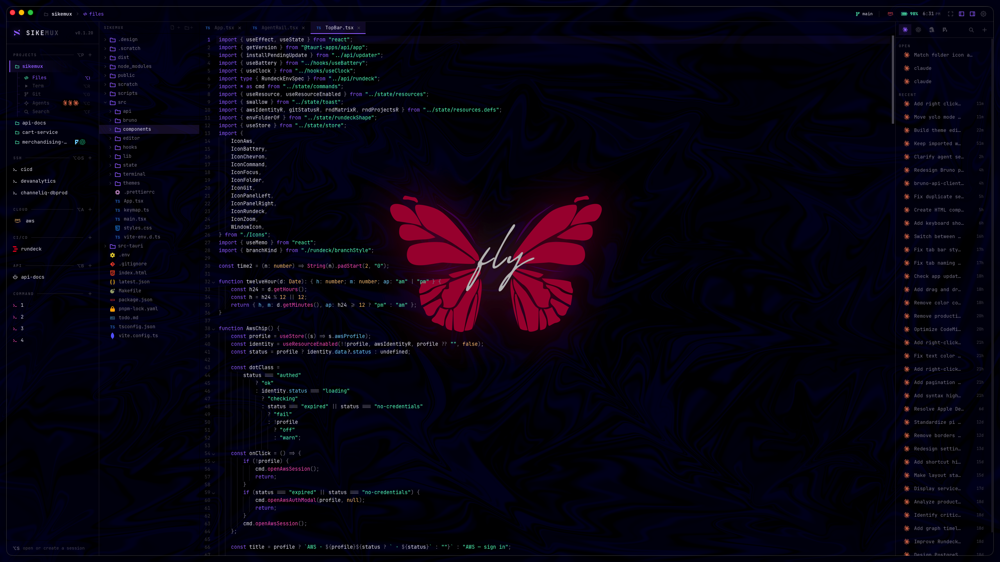
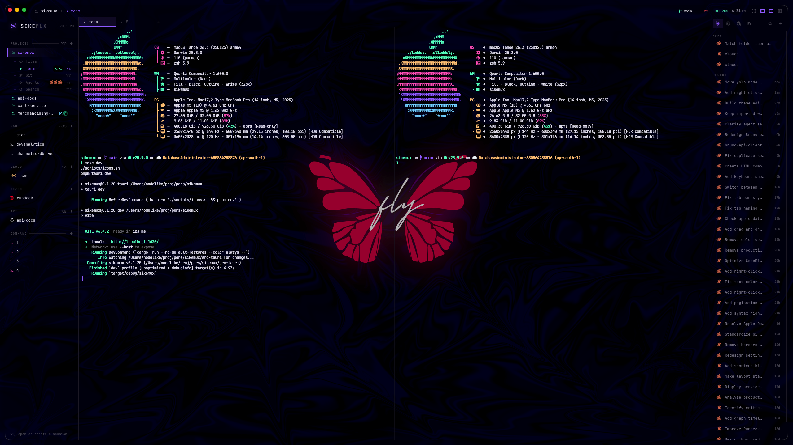
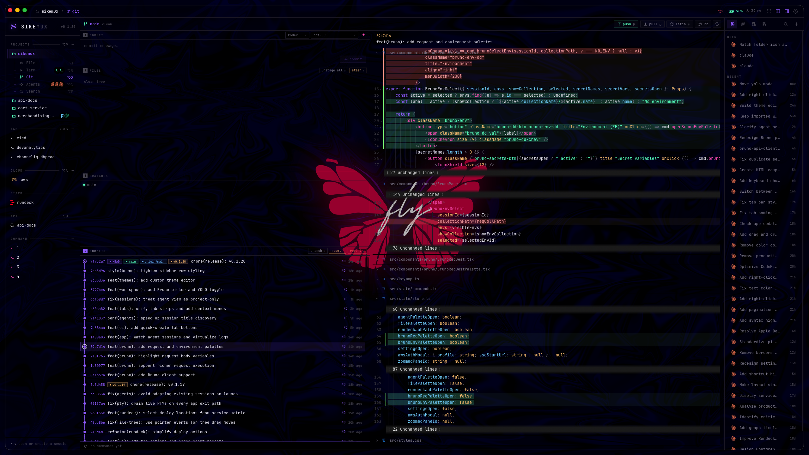
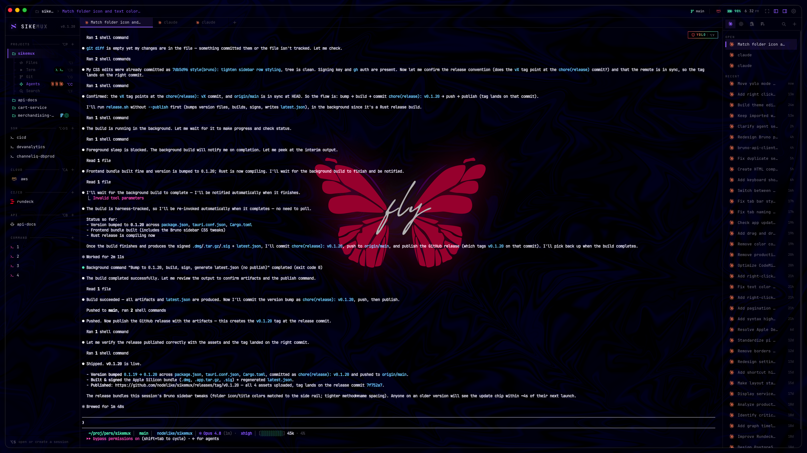
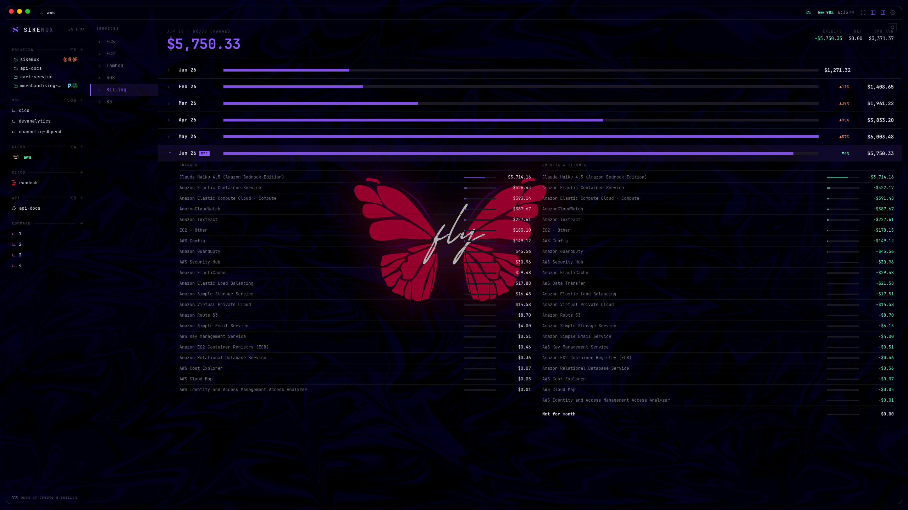
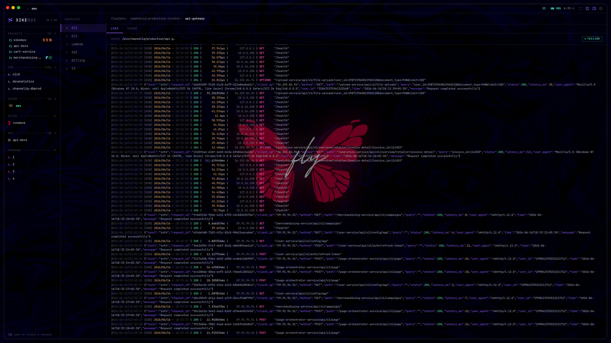
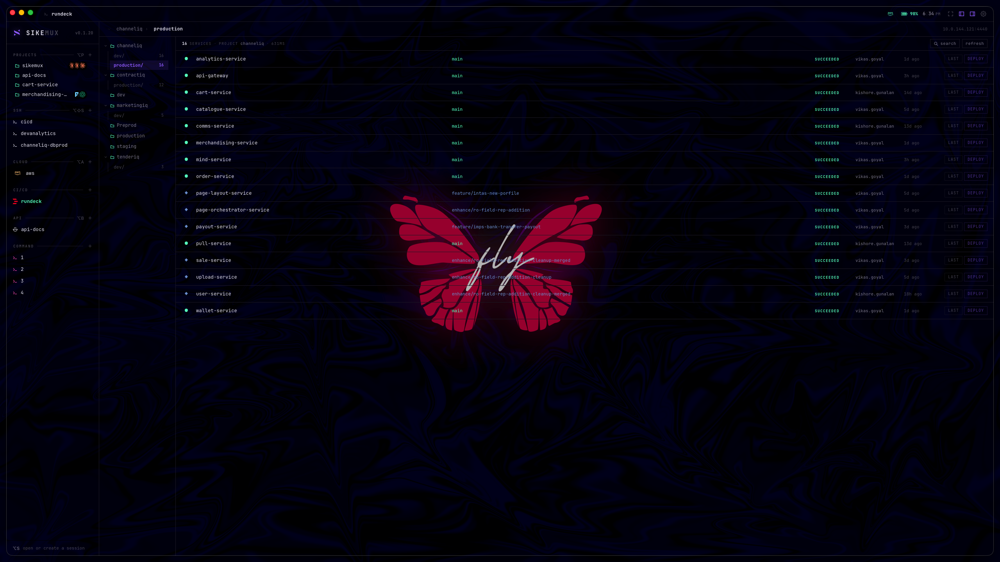
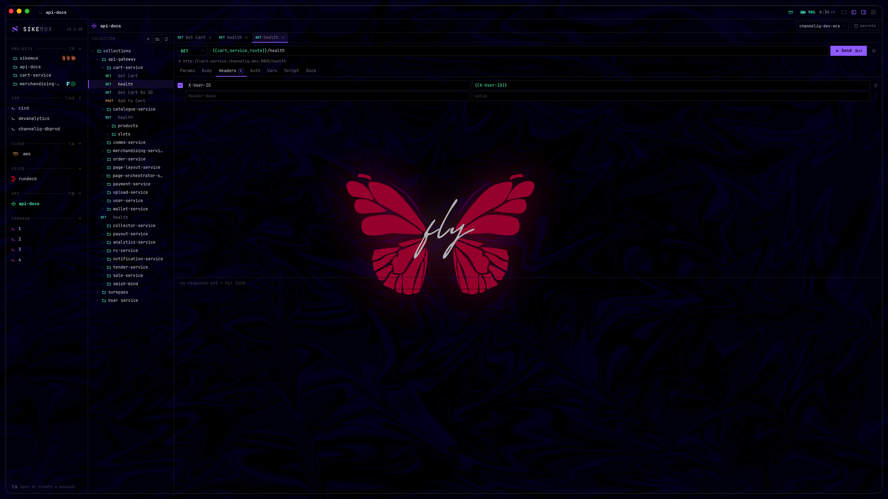

<div align="center">

# Sikemux

**A GUI terminal multiplexer for people who live in the terminal — but want their editor, git, cloud, CI/CD and API tooling in the same window. Built with Tauri + Rust + React.**



[](#installation)
[](https://tauri.app)
[](https://react.dev)
[](https://www.rust-lang.org)
[](https://github.com/nodelike/sikemux/releases/latest)

</div>

---

## Features

### 🗂 Projects — editor, terminal, git & agents in one session

A project session bundles five views (`Files`, `Term`, `Git`, `Agents`, `Search`) over a single working directory.

- **Code editor** — CodeMirror 6 with syntax for JS/TS/JSX, Python, Rust, Go, HTML, CSS, JSON, YAML, Markdown (+ legacy modes), inline **LSP** hover / go-to-definition / peek, project-scoped **Problems** and **Outline**, git gutter, find & replace, indentation guides, and virtualized rendering for big files.
- **Diff & merge** — side-by-side diff editor and a three-way merge review for conflict resolution.
- **File tree** — live filesystem watchers (no drift), create / rename / delete, and native drag-and-drop to move files or drop them in from Finder.

<table>
<tr>
<td width="50%"></td>
<td width="50%"></td>
</tr>
<tr>
<td align="center"><b>Integrated terminal</b> — xterm.js with gated WebGL acceleration, real PTYs via Rust, split panes, tabs, drag-drop paths.</td>
<td align="center"><b>lazygit-style git</b> — branches, staging, commits, diffs, merge, pull/push, worktrees, and local-CLI-powered commit messages.</td>
</tr>
</table>

### ⚙️ Project actions, tasks & previews

Projects can check in a bounded `sikemux.json` file. Its actions and tasks appear in the command deck (`⌘⇧P` on macOS, `Ctrl+Shift+P` on Windows), and actions can declare project-scoped keyboard shortcuts. The only accepted action context is `"project"`; an empty context list also means throughout the owning project. Executable project configuration is never trusted silently: Sikemux shows what can run, remembers approval only for the current process, and asks again whenever the file content changes.

```json
{
  "version": 1,
  "actions": [
    {
      "id": "quality",
      "label": "Run quality checks",
      "description": "Format, lint and test",
      "command": "pnpm check",
      "placement": "terminal",
      "contexts": ["project"],
      "keybinding": "Meta+Shift+KeyT"
    }
  ],
  "tasks": [
    {
      "id": "dev",
      "label": "Development server",
      "command": "pnpm dev",
      "cwd": ".",
      "env": { "NODE_ENV": "development" }
    }
  ],
  "preview": {
    "url": "http://localhost:5173",
    "command": "pnpm dev"
  }
}
```

Project bindings use physical key codes (`Meta` on macOS, normally `Ctrl` on Windows). The `env` object is part of the checked-in file, so use it for ordinary task configuration—not secrets.

Tasks run in exact, runtime-owned native PTYs rather than a second renderer-owned process. Their terminal views can detach and reattach without killing the task; restart and stop are generation-safe, and Stop remains available even if the configuration is removed or becomes invalid while a task is running. Task environment values stay out of persisted terminal state and diagnostics.

### 🤖 AI coding agents

Run coding agents right next to the code they're editing. Sikemux auto-detects **Claude, Codex, Hermes, Pi and OpenCode** on your `PATH`, surfaces their past sessions, and lets you spin up several per project from the agent rail.

- Multiple concurrent agents per project, each in its own pane.
- Reads agent session histories so you can resume threads.
- **Agent picker** (`⌥N` from the Agents view) opens the selected CLI directly in a PTY—no launch prompt or worktree form.
- Only two launch modes: **Normal** and **YOLO**. Toggle a resumable agent with `⌥Y`.
- **Embedded browser** — `⌘T` lazily splits the active agent pane, with session-owned tabs, persistent sign-ins, human takeover and Browser Use tools injected into Claude and Codex automatically.



### ☁️ Cloud — an AWS console you actually keep open

A built-in AWS panel for the things you check all day, with one-click refresh so console changes show up instantly.

- **Cost & billing** explorer.
- **ECS** services & tasks with live **CloudWatch log tailing** (selectable/copyable while streaming).
- **EC2, Lambda, S3, SQS** browsers.

<table>
<tr>
<td width="50%"></td>
<td width="50%"></td>
</tr>
</table>

### 🚀 CI/CD — Rundeck deploy center

Drive Rundeck without leaving the app: browse projects, fire jobs from a palette, and watch deployments stream **step-by-step progress and per-step output** in real time.

HTTPS is the default. Private-subnet Rundeck installations may explicitly opt into HTTP at sign-in; Sikemux accepts it only while every resolved address is private, loopback, or link-local, pins the verified addresses into the credential/token client to prevent DNS rebinding, and persists the acknowledgement alongside the chmod-600 token configuration.



### 🔌 API — Bruno workspace

Open your [Bruno](https://www.usebruno.com/) collections as first-class sessions and run requests with a keyboard-first flow.

- Request palette (`⌘P`) and environment palette (`⌥E`).
- Save with `⌘S`, send with `⌘↵`, scripting sandbox for pre/post hooks.



### 🔐 SSH & ⌨️ Command sessions

Connect to SSH hosts (`⌥⇧S`) or open scratch command shells (`⌥S`) as their own multiplexed sessions.

### ⌨️ Command-line editor integration

Packaged builds include a native `sikemux` CLI that hands files and project directories to the running app. It supports editor-style line and column locations plus `--wait`, so tools such as Git can pause until the opened tab is closed. Install the launchers from **Settings → CLI**; Sikemux refuses to replace unrelated files and never edits your shell startup files.

```bash
sikemux .
sikemux src/App.tsx:42:5
sikemux open --wait README.md
EDITOR=sikemux-editor git commit
```

Sikemux-owned terminals identify themselves with `TERM_PROGRAM=Sikemux`, `SIKEMUX=1`, the app version, and typed session/project/pane or agent context. When neither `EDITOR` nor `VISUAL` is already configured, both point to the bundled wait-enabled editor CLI; existing user choices are preserved.

### 🎨 Themes & chrome

- **9 built-in themes** — Aura, Ayu Dark, Tokyo Night, Catppuccin Mocha, Dracula, Gruvbox Dark, Nord, One Dark, Solarized Dark.
- **Custom theme editor** — tune interface, editor, syntax and the full 16-color terminal palette, then save your own.
- Frameless overlay title bar, adjustable **window transparency & blur** (macOS private API), and a distraction-free **Zen mode**.

### 🔄 And the glue

Tiling pane splits with vim-style focus movement, fuzzy session picker, bounded back/forward editor navigation, live update notifications via the built-in **auto-updater**, and transactional persisted layout across restarts. Local shells can report their current directory, command phase and last exit status through bounded shell integration without modifying dotfiles. Runtime diagnostics combine redacted browser/native traces, latency percentiles, subsystem counts and an OS-thread watchdog that can preserve evidence while the WebView is stalled.

## Keyboard shortcuts

These are the defaults. Every command can be reassigned or cleared in **Settings → Keybindings**; changes save automatically.

| Key       | Action                               |     | Key              | Action                    |
| --------- | ------------------------------------ | --- | ---------------- | ------------------------- |
| `⌥S`      | Open / create a session              |     | `⌥\` / `⌥-`      | Split pane (row / column) |
| `⌥P`      | Open project                         |     | `⌥H/J/K/L`       | Move focus between panes  |
| `⌥⇧S`     | Connect SSH host                     |     | `⌥⇧H/J/K/L`      | Resize active pane        |
| `⌥A`      | Open AWS                             |     | `⌥Z`             | Zoom / unzoom pane        |
| `⌥B`      | Open Bruno workspace                 |     | `⌥W`             | Close focused pane        |
| `⌥1`–`⌥5` | Files / Term / Git / Agents / Search |     | `⌥Tab` / `⌥⇧Tab` | Cycle session / group     |
| `⌥[` `⌥]` | Prev / next window                   |     | `⌥N`             | New terminal/agent picker |
| `⌘P`      | File / request palette               |     | `⌥Y`             | Toggle agent YOLO mode    |
| `⌘⇧F`     | Global search                        |     | `⌥U`             | Last-used session         |
| `⌘⇧P`     | Command deck                         |     | `⌥T`             | Focus command terminal    |
| `⌘T`      | New embedded browser tab             |     | `⌘L`             | Focus browser address     |
| `⌘,`      | Settings                             |     | `Esc`            | Dismiss active modal      |

On Windows, use `Ctrl` for `⌘` shortcuts and `Alt` for `⌥` shortcuts.

## Installation

### Download (recommended)

Grab the latest `.dmg` from the [**Releases**](https://github.com/nodelike/sikemux/releases/latest) page. Published releases currently target **Apple Silicon** and require **macOS 11+**. Sikemux ships an auto-updater, so it keeps itself current after that. Intel Macs are not currently covered by the published updater feed.

### Build from source

**Prerequisites:** [Rust](https://www.rust-lang.org/tools/install), Node.js 22+, and [pnpm](https://pnpm.io/).

```bash
git clone git@github.com:nodelike/sikemux.git
cd sikemux
pnpm install

# Hot-reload dev (Vite + Tauri, isolated from the installed app)
make dev            # or: pnpm dev:desktop

# Production Apple Silicon .app + .dmg on an Apple Silicon host
make build          # or: pnpm build:mac

# Explicit local universal build (Apple Silicon + Intel; not the published feed)
pnpm build:mac:universal

# Windows NSIS installer (run from Windows)
pnpm build:windows
```

AI commit-message generation runs through a locally installed **Hermes**, **Codex**, or **Claude** CLI—Sikemux makes no direct model-provider request and needs no API key of its own. Pick the CLI and model in the commit panel; response output streams directly into the commit box. Claude's partial-message stream and Codex's local app-server both provide token-level text deltas; Hermes output is forwarded whenever its quiet CLI mode flushes it. Large changes use zero-context diffs with budget-aware coverage across every file and hunk, while noisy generated and lockfile bodies are summarized.

Windows development requires Microsoft C++ Build Tools and WebView2. Sikemux uses native ConPTY with PowerShell as its default Windows shell.

The terminal uses xterm.js's DOM renderer by default. To exercise the opt-in WebGL renderer, launch with `VITE_TERMINAL_WEBGL=1 pnpm dev:desktop`. Development uses the separate `com.nodelike.sikemux.dev` identity, so it can run alongside the installed app without tripping the single-instance guard or sharing its application-data directory. Sikemux automatically falls back to DOM rendering if WebGL initialization fails or its context is lost; `window.sikemuxDiagnostics?.snapshot()` reports the active renderer counts.

Run `make check` for the full local quality gate: Prettier, ESLint, TypeScript, deterministic frontend tests, Rust formatting, Clippy, Rust tests, and credential-free release-tooling verification. `make test-coverage` reports coverage across all frontend TypeScript/TSX source, including files no test imports. `make run` launches an already-built release binary.

### Community releases without an Apple Developer membership

The updater and Apple Gatekeeper are separate trust systems. `scripts/release.sh` defaults to a **community release**: the updater archive is signed with the Tauri updater key and the app/DMG receive a structurally valid ad-hoc code signature. This supports in-app updates for the existing community installation flow, but fresh downloads are not Apple-notarized and macOS may require removing quarantine again. Keep the updater private key secure; clients reject archives that do not match the public key embedded in the app.

Stable releases use a versioned GitHub release and update the normal `latest.json` feed. Preview builds require a prerelease semver and update the moving `preview` release consumed by the opt-in Preview channel:

```bash
./scripts/release.sh 0.2.0 "Release notes" --publish
./scripts/release.sh 0.3.0-beta.1 "Preview notes" --preview --publish
```

Omit `--publish` to perform the complete signed build and verification without changing GitHub.

After joining the Apple Developer Program, set `RELEASE_NOTARIZED=1` plus the Developer ID and notarization environment variables. The same script then requires Gatekeeper assessment and stapled notarization tickets before publishing.

## Contributing

PRs and issues are welcome — see [CONTRIBUTING.md](CONTRIBUTING.md) for setup, project layout, and the checks to run before opening a PR.

## License

[MIT](LICENSE) © nodelike

---

<div align="center">
<sub><code>sike</code> + <code>mux</code> — built by <a href="https://github.com/nodelike">@nodelike</a></sub>
</div>
